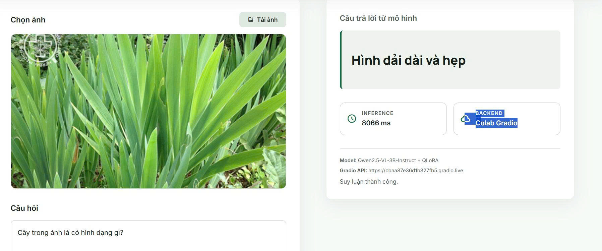
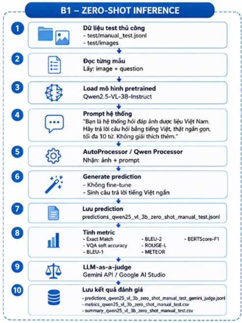
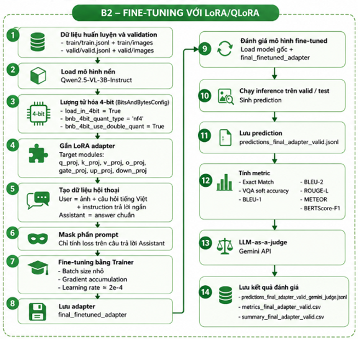

# Vietnamese Medicinal Herb VQA

Visual Question Answering for Vietnamese medicinal herb images using **Qwen2.5-VL-3B-Instruct**. The project includes a zero-shot baseline, QLoRA fine-tuning, PPO after SFT, automatic evaluation, LLM-as-a-judge scoring, preference data, and a FastAPI demo that calls a Gradio model server running on Colab.



## Overview

This repository implements a domain-specific VQA system for Vietnamese medicinal herbs. Given an herb image and a Vietnamese question, the model returns a short Vietnamese answer, usually no longer than 10 words.

Example:

```text
Image: medicinal herb image
Question: Hoa trong anh co mau gi?
Answer: Mau trang
```

The project follows the **Multimodal Pretrained** direction with:

```text
Qwen/Qwen2.5-VL-3B-Instruct
```

Two main experimental pipelines are implemented:

- **B1 - Zero-shot inference**: run the pretrained model directly without fine-tuning.
- **B2 - QLoRA fine-tuning**: fine-tune a lightweight adapter on the Vietnamese medicinal herb VQA dataset.

Additional extensions:

- **PPO after SFT** with a reward based on VQA soft accuracy and normalized BERTScore-F1.
- **Preference data** for comparing SFT and RL/PPO responses.
- **FastAPI + Gradio API demo** for local UI inference while the model runs on Colab.

## Hugging Face Resources

| Resource | Link |
|---|---|
| Dataset | <https://huggingface.co/datasets/gdllelf/vietnamese-medicinal-herb-vqa> |
| SFT/QLoRA adapter | <https://huggingface.co/gdllelf/qwen25-vl-herb-qlora-adapter> |
| PPO adapter | <https://huggingface.co/gdllelf/qwen25-vl-herb-ppo-adapter> |
| Base model | <https://huggingface.co/Qwen/Qwen2.5-VL-3B-Instruct> |

Large image folders and adapter ZIP files are hosted on Hugging Face instead of GitHub to keep this repository lightweight.

## Dataset

The dataset focuses on **Vietnamese medicinal herbs and traditional medicinal plants**. Each sample is an image-question-answer triple.

```json
{
  "id": "P000002676",
  "name": "Cay He",
  "image": "images/P000002266.jpg",
  "question": "Hoa trong anh co mau gi?",
  "answer": "Mau trang"
}
```

Question types include:

- Herb identification.
- Visual attributes such as leaf shape, flower color, fruit color, stem shape, and plant parts.
- Yes/no questions.
- Spatial questions.
- Medicinal part questions.
- Basic medicinal use and herb knowledge questions.

## Dataset Statistics

| Split | Images | QA pairs | File |
|---|---:|---:|---|
| Train | 3032 | 23211 | `train/train.jsonl` |
| Validation | 379 | 2998 | `valid/valid.jsonl` |
| Manual test | 380 | 2952 | `test/manual_test.jsonl` |

## Pipeline B1 - Zero-shot Inference



Pipeline B1 measures how well the original pretrained model performs before any task-specific training.

Steps:

1. Load `Qwen/Qwen2.5-VL-3B-Instruct`.
2. Read the manual test set from `test/manual_test.jsonl`.
3. Build a Vietnamese VQA prompt for each image-question pair.
4. Send the image and question to the base model.
5. Generate a short Vietnamese answer.
6. Compare the prediction with the reference answer.
7. Report exact match, VQA soft accuracy, BLEU, ROUGE-L, METEOR, BERTScore-F1, and LLM-as-a-judge.

Purpose:

- Establish the baseline ability of the pretrained multimodal model.
- Identify failure cases before domain adaptation.
- Provide a fair comparison point for B2.

## Pipeline B2 - QLoRA Fine-tuning



Pipeline B2 adapts Qwen2.5-VL-3B-Instruct to the medicinal herb VQA domain using QLoRA. The base model is kept frozen and only LoRA adapter weights are trained.

Steps:

1. Load the same base model: `Qwen/Qwen2.5-VL-3B-Instruct`.
2. Load the cleaned training and validation splits.
3. Convert image-question-answer triples into instruction-style multimodal samples.
4. Fine-tune with QLoRA to reduce GPU memory usage.
5. Save the final adapter as `final_finetuned_adapter`.
6. During inference, load the base model plus the trained adapter.
7. Evaluate on the validation or manual test set using the same metrics as B1.

Vietnamese strategy:

- Questions and answers are kept in Vietnamese.
- The model is prompted to answer briefly in Vietnamese.
- Answers are normalized before metric calculation.

## B1 vs B2 Evaluation

Evaluation was performed using the same metric suite for both pipelines.

| Metric | B1 Zero-shot | B2 Fine-tuned | Difference B2-B1 |
|---|---:|---:|---:|
| Exact Match | 0.0037 | 0.1799 | +0.1761 |
| VQA soft accuracy | 0.0037 | 0.1799 | +0.1761 |
| BLEU-1 | 0.1804 | 0.4006 | +0.2203 |
| BLEU-2 | 0.1083 | 0.2588 | +0.1505 |
| ROUGE-L | 0.3128 | 0.4972 | +0.1843 |
| METEOR | 0.2051 | 0.3263 | +0.1212 |
| BERTScore-F1 | 0.8227 | 0.8800 | +0.0574 |
| LLM-as-a-judge | 0.4557 | 0.4872 | +0.0316 |

Main observation:

- Fine-tuning improves every automatic metric.
- The largest gains appear in exact-match-style and lexical metrics.
- BERTScore-F1 improves more moderately because semantic similarity is already relatively high in some zero-shot outputs.
- LLM-as-a-judge also improves, showing that B2 produces answers that are more acceptable semantically, not only lexically closer.

## PPO After SFT

The repository also includes a PPO training setup after supervised fine-tuning.

Reward configuration:

```text
reward = 0.5 * VQA_soft_accuracy + 0.5 * normalized_BERTScore_F1
```

Example PPO run summary:

```json
{
  "train_mode": "ppo_after_sft_2chunks_resume",
  "num_rows": 1000,
  "lr": 0.000005,
  "ppo_epochs": 1,
  "clip_eps": 0.2,
  "kl_coef": 0.05,
  "mean_reward": 0.2516,
  "mean_vqa_soft_acc": 0.1453,
  "mean_bertscore_f1_norm": 0.3579,
  "mean_bertscore_f1_raw": 0.8657
}
```

The PPO adapter is stored separately on Hugging Face so that SFT and RL/PPO checkpoints can be compared independently.

## Preference Data

Preference data is used to compare SFT and PPO/RL answers through automatic scoring and optional human review.

Recommended compact format:

```json
{
  "id": "pref_000001",
  "source_id": "P000003114_q000001",
  "image": "images/P000003065.jpg",
  "question": "Day la loai duoc lieu gi?",
  "reference_answer": "Ho diep",
  "sft_answer": "Day la cay Ho diep.",
  "rl_answer": "Ho diep",
  "sft_bertscore_f1": 0.88,
  "rl_bertscore_f1": 0.95,
  "auto_preference": "rl",
  "auto_preference_margin": 0.07,
  "auto_preference_method": "bertscore_f1_only",
  "human_eval": {
    "preference": null,
    "comment": ""
  }
}
```

This format is intentionally simple and works well for reporting automatic preference and collecting human evaluation.

## Demo

The demo keeps the original interface idea but removes the attention heatmap. It focuses on the final **B2 fine-tuned pipeline**.

Architecture:

```text
User browser
  -> FastAPI local backend
  -> Gradio API URL from Colab
  -> Qwen2.5-VL-3B-Instruct + QLoRA adapter
  -> Vietnamese answer
```

Demo features:

- Upload a medicinal herb image.
- Enter a Vietnamese question.
- Call the model server running on Colab.
- Display the generated answer and inference status.

The interface screenshot below shows the final local demo:


## Project Structure

```text
.
├── colab/                  # Colab notebooks for zero-shot, SFT, PPO, preference data
├── demo/                   # FastAPI UI and Gradio API client
├── evaluation/             # Predictions, metric files, and summaries
├── picture/                # README images and pipeline diagrams
├── ppo/                    # PPO training data
├── scripts/                # Data cleaning and preprocessing scripts
├── test/                   # Manual test JSON/JSONL
├── train/                  # Training JSON/JSONL
├── valid/                  # Validation JSON/JSONL
├── herb_final.json         # Final herb metadata
├── herb_images.json        # Image metadata
├── split_summary.json      # Dataset split statistics
└── README.md
```

## Run The Local Demo

Install dependencies:

```bash
cd demo
python -m venv .venv
.\.venv\Scripts\activate
pip install -r requirements.txt
```

Create `demo/.env`:

```env
GRADIO_API_URL=https://your-colab-gradio-url.gradio.live
GRADIO_API_NAME=/predict
```

Start the backend:

```bash
.\run.ps1
```

Open:

```text
http://127.0.0.1:8000
```

## Notes

- The GitHub repository stores code, notebooks, evaluation results, diagrams, and compact dataset metadata.
- Full image data is hosted in the Hugging Face dataset repository.
- Final SFT and PPO adapters are hosted in separate Hugging Face model repositories.
- The demo requires a running Colab Gradio server because the full VLM is too heavy for a normal local CPU environment.

## License

This repository is prepared for academic coursework and research demonstration. Check the licenses of the base model, dataset sources, and third-party libraries before any production or commercial use.
